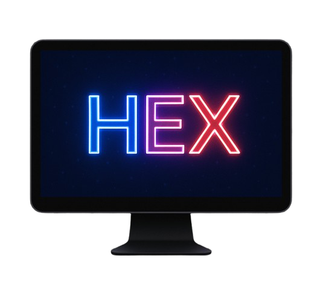

<h1 style="display: flex; align-items: center;">  Auto-Clicker [HEX]</h1>

___
## DOWNLOAD [Installer or EXE]
(Recommended) You can download Installer for windows from [here](https://drive.google.com/file/d/14GlMkg0sQuIZ0rvF0DzHvT2FLV5WkoqN/view?usp=sharing)

(For manual download & setup) You can download EXE file for windows platform from [here](https://drive.google.com/file/d/1z1kjraVPcFRtISTDvNorAT3EEGhM-kRr/view?usp=sharing)

If you are using manual download and setup so keep all the files come with exe in one folder with exe. If any file missing except .configs.json this software will not run I recommend you to create shortcut of exe and put it on desktop to quick startup the software.

---
## DOCUMENTATION
This is an autoclicker software name HEX specially build for _minecraft_, It consists of two types of tools **builder** and **autoclicker**.

Click buttons name **AutoClicker** and **Builder** both when you have started software to activate both the tools.

**OR**

Click **stop all** button to deactivate both the tools.
## Builder
This tool use for place block rapidly, helps to do clutches in minecraft. It rapidly clicks left mouse button at a defined CPS. 
- To start this tool press R on keyboard.
- Then click right mouse button to start or stop clicking of _left mouse button_.
- To stop until R not pressed again click Q on keyboard then scroll the mouse wheel.

## Auto-Clicker
This tool use for hitting players or entity in minecraft, It rapidly clicks _right mouse button_ at a defined CPS.
- To start this tool press Q on keyboard.
- To stop this tool scroll the mouse wheel.

## Settings
You can customize **CPS**, **Debounce**, **click repeat** of both the tools by using settings option.

#### DEBOUNCE IS INVERSELY PROPORTIONAL TO CPS.

- **Debounce** : Delay between two clicks.
- **Click Repeat** : Number of clicks trigger at once.
- **CPS (click per second)** : Automatically calculated by program by using CPS formula.

After doing changes click save settings or close settings window to do not save settings.

## CPS Formula
`CPS = 999/(P*debounce_in_ms)+1`
where **P** is _power pizza's constant_ 😅 having value **1.3**

## Files
**.configs.json** : This file automatically creates whenever this software starts and this file stores all the settings like window transparency, debounce etc.

## Window Transparency
To hide the HEX Software window you can right-click the window and to make it appear again left-click the window.

MAX transparency and MIN transparency can be changed from **.configs.json** its value range from 0 to 1 decimal value.

## NOTE
- Every setting of **.configs.json** file can not be changed from software's settings button. I will make **.configs.json** fully customizable from settings button in feature for now only some options of **.configs.json** are available in settings button.
- Only one tool will be running at a time.
- CPS formula is not 100% accurate it gives approx value of CPS.
